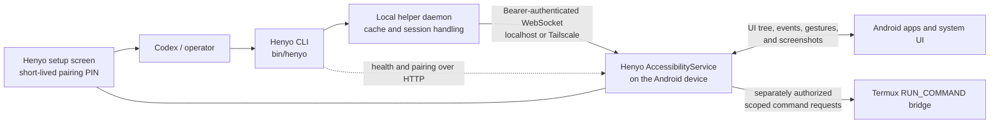

# Henyo

Henyo is a local-first Android accessibility bridge for agent control from
Termux on the same device or from an authenticated Tailnet client.

Henyo runs on the Android device and exposes its accessibility tree, gestures,
screenshots, and selected Termux operations through a small authenticated API.
It does not require a hosted Henyo service: clients connect directly over
localhost or an explicitly enabled Tailnet route.

## How it works



The accessibility service is the only component that interacts with Android
UI. The helper keeps client sessions and short-lived observations local. A
Tailnet address alone does not grant control: remote clients must come from an
allowed CIDR and present a token created through the on-screen pairing flow.

## Prerequisites

Henyo's custom Gradle build expects Java 11 or newer plus `aapt2`, `d8`,
`apksigner`, and `adb` on `PATH`. Set `ANDROID_HOME` or `ANDROID_SDK_ROOT` to a
standard Android SDK containing platforms 30 and 35. For a custom layout,
provide the platform jars explicitly:

```sh
export HENYO_ANDROID_JAR=/path/to/android-30/android.jar
export HENYO_COMPILE_ANDROID_JAR=/path/to/android-35/android.jar
```

The legacy local fallback paths are `sdk/android-11/android.jar` and
`sdk/android-35/android.jar`; `sdk/` is intentionally ignored.

## Build

```sh
gradle assembleDebug
```

The debug APK is written to:

```text
build/henyo-debug.apk
```

The default application ID and Java namespace are both `link.liaru.henyo`.
Debug builds use a local debug key outside `build/`; they are not official
Henyo release artifacts.

## Maintainer release build

Official APKs are signed locally with the long-lived Henyo release key. The
key and its credentials stay under `~/.config/henyo/signing/` and are never
stored in Git or GitHub Actions.

```sh
scripts/build-release.sh 0.1.0 1
```

The script runs the checks, verifies the application ID and pinned signing
certificate, and writes:

```text
build/henyo-v0.1.0.apk
build/henyo-v0.1.0.apk.sha256
```

Contributors do not need the release key; use `gradle assembleDebug` for local
builds.

## Install

1. Download `henyo-vX.Y.Z.apk` and its `.sha256` file from the
   [GitHub release](https://github.com/liaru-lab/henyo/releases/latest).
2. Verify the download when `sha256sum` is available:

   ```sh
   sha256sum -c henyo-vX.Y.Z.apk.sha256
   ```

3. Open the APK. Android will ask the browser or file manager for permission
   to install an app from that source. This is expected for an APK distributed
   outside Google Play.
4. On Android 13 or newer, open **Settings > Apps > Henyo**, use the overflow
   menu, and choose **Allow restricted settings**. Vendor wording may differ.
5. Open **Settings > Accessibility > Installed apps > Henyo** and enable the
   service. Android shows a strong warning because an accessibility service can
   inspect the screen and perform actions; enable it only if you trust the APK
   and its source.

The package name is `link.liaru.henyo`. Updates must use an APK signed by the
same Henyo release certificate. Maintainer deployments use
`scripts/deploy-android.sh` to preserve the signing identity and app data.

## Enable Service

The service name is:

```text
link.liaru.henyo/link.liaru.henyo.HenyoAccessibilityService
```

It can be enabled manually from Android accessibility settings, or through ADB shell when permitted.

## Pair a client

Pairing creates a revocable Bearer token without sending a persistent secret
through the Android UI:

1. Open Henyo on Android.
2. For a remote client, enable remote access, select `0.0.0.0`, confirm the
   allowed Tailnet CIDRs, and save. Keep `127.0.0.1` for same-device-only use.
3. Tap **Start remote pairing**. Henyo displays a short-lived six-digit PIN.
4. On the client, point the CLI at the device's Tailnet address and register
   while the pairing window is active. Choose the command for your platform.

   Linux/macOS:

   ```sh
   export HENYO_URL='http://100.64.x.y:8765'
   bin/henyo auth register --name 'my-client' --pin PIN --save
   bin/henyo health
   bin/henyo tree 3
   ```

   Windows PowerShell (experimental):

   ```powershell
   $env:HENYO_URL = "http://100.64.x.y:8765"
   .\bin\henyo.ps1 auth register --name "Windows PC" --pin PIN --save
   .\bin\henyo.ps1 health
   .\bin\henyo.ps1 tree 3
   ```

`--save` stores the token in `~/.config/henyo/config` and redacts it from command
output. Unix-like clients apply mode `0600`; Windows uses the account's normal
file permissions. Pairing is one-time and expires automatically; saved clients
can be reviewed and revoked from Henyo.

## API

The accessibility service listens on localhost:

```text
http://127.0.0.1:8765
```

The OpenAPI contract for the stable v1 API is stored at:

```text
docs/openapi.yaml
```

Remote access is disabled by default and localhost remains the default listener.
When explicitly enabled, remote requests must come from an allowed CIDR. The
default Tailnet CIDRs are:

```text
100.64.0.0/10
fd7a:115c:a1e0::/48
```

Tailnet source IP is not enough to control the device. Remote control and token
management APIs require `Authorization: Bearer <token>` in addition to the
allowed CIDR check. Tokens are registered through a local pairing session: the
Android screen shows a short-lived 6-digit PIN with a countdown ring, and the
remote client exchanges that PIN for a Bearer token during the pairing window.
Henyo accepts the current code, the displayed next code, and the six preceding
30-second codes so an agent can complete registration despite model latency.

For recovery and local setup, localhost can bootstrap a management token with
`POST /v1/auth/tokens/local`. This endpoint is intentionally localhost-only and
returns the raw token exactly once; Henyo stores only the token hash and
metadata. Stored tokens can be listed with `GET /v1/auth/tokens` and revoked
with `DELETE /v1/auth/tokens/{tokenId}`.

During a package/signing migration, localhost can preserve an already saved
client credential with `POST /v1/auth/tokens/import-local`. The raw token is
accepted only from localhost, is immediately hashed, and is never returned.

Each active client also has a local-only **Allow arbitrary commands in
Termux** switch. It is off for every new token. `termux.exec` requires a real
paired token with this capability even when the WebSocket originates from
localhost; the usual token-less localhost compatibility does not apply to
Termux execution. The Android app additionally needs Termux's
`com.termux.permission.RUN_COMMAND` permission, and Termux must contain
`allow-external-apps = true` in `~/.termux/termux.properties`.

The remote access endpoint classes, pairing flow, and security model are
summarized in:

```text
docs/remote-access.md
```

The primary agent control protocol is WebSocket. HTTP v1 remains available
during migration for health, pairing, compatibility, and debugging:

```text
docs/ws-control-protocol.md
```

While at least one authenticated WebSocket control session is connected, Henyo
draws a restrained dark-navy and cyan inward glow from the top edge using the
app icon's palette. A control call or batch expands it into a translucent
whole-display inner glow with soft cyan corner pulses. Recent activity holds
for 20 seconds and then fades over 1.8 seconds, bridging slower agent pauses
instead of repeatedly collapsing. The first activation and any fade reversal
ease into one uptime-based pulse; a new call extends the lease without resetting
the pulse phase. The lower navy shade shares that lease, so it is already present
before a caption is drawn and remains when a call has no summary.

Calls and batches may include a short `display.summary`. Up to three natural-
language summaries appear near the lower-left edge with a brief type-in effect;
new messages enter below older, dimmer messages. The newest row carries a
cycling Braille activity spinner and a thin terminal scan-line caret at the
current reveal position. The caret holds briefly, then eases between bright and
dim states on a one-second cycle. The spinner occupies its own indicator column
while all body text aligns beside it. Larger bold off-white text sits in a full-width
icon-navy shadow that grows darker toward the physical bottom edge and merges
with the active inner glow; a barely visible technical grid fades upward with
it. There is no popup-card boundary, separate panel halo, dark text outline, or
operation-category label. Raw selectors and entered values are never converted
into a summary automatically.

Completed multi-step tasks use the separate `task.completion.show` presentation,
not `display.summary`. It wraps a final message of up to 250 Unicode code points
in full without ellipsis, spinner, or caret, holds for 30 seconds, then fades
gently. Callers explicitly finish task progress first, so the final result never
double-stacks a stale plan. Completion text is ephemeral and is not echoed,
logged, persisted, cached, included in diagnostics, or replayed.

Tree, find, wait, screenshot, and combined observation calls add one restrained
cyan scan from the top of the display toward the bottom. Internal observation
retries and post-action settling do not restart it. Manipulative actions share
one persistent 58dp Henyo glove cursor. Its first session position is the screen
centre; later actions travel from the retained wrist position to their real
target over a distance-based 180–450ms ease before the operation executes.
Every move uses the pointing pose. At the action start it switches to the one
required action pose: pointing for clicks and text targets, the back of an open
right hand for swipes and scrolls, or the left-pointing hand for Back. Only one
sprite is drawn at a time. After the action, that pose lingers for 240ms, returns
to the pointing pose for 180ms, then eases to 18% opacity over 420ms. The next
move restores full opacity over 120ms. All sprites use a common wrist anchor so
pose changes do not jump. The cursor remains at that subdued opacity during the
20-second activity lease, then fades and resets with the shared activity treatment. Its attached
navy cuff has cyan rim piping; the restrained 2.25dp cyan halo is composited by
the app rather than baked into the sprite. Scan and glove cues are mutually
exclusive. They are composited below the navy shade and captions in the same
full-screen overlay; the scan also fades to zero in the caption safe area.

The accessibility overlays are non-touchable, non-focusable, excluded from
accessibility traversal, and removed when the final authenticated session
disconnects. A session closes after 60 seconds without a call or batch. The
helper reconnects lazily on the next Android operation, so the connected state
does not remain indefinitely between occasional CLI commands.

Henyo-managed screenshots hide the glow and activity text for roughly two render frames
before capture and restore it as soon as Android returns the image buffer, so
`screen.screenshot` and the screenshot inside `ui.observe` are clean by
default. Raw WS/HTTP callers may pass `includeIndicator:true` when explicitly
debugging the visual indicator. System and ADB screenshots are outside Henyo's
capture path and continue to show the glow.

Current remote access settings can be inspected locally with:

```sh
curl --noproxy '*' http://127.0.0.1:8765/v1/remote/access
```

v1 uses `GET` for reads and `POST` with JSON bodies for actions:

```sh
curl --noproxy '*' http://127.0.0.1:8765/v1/health
curl --noproxy '*' 'http://127.0.0.1:8765/v1/ui/tree?maxDepth=3&onlyTextNodes=true'
curl --noproxy '*' -X POST -H 'Content-Type: application/json' \
  -d '{"selector":{"text":"Battery","exact":true,"field":"text"}}' \
  http://127.0.0.1:8765/v1/ui/click
curl --noproxy '*' -X POST -H 'Content-Type: application/json' \
  -d '{"bounds":"928,141,1050,263"}' \
  http://127.0.0.1:8765/v1/ui/click
curl --noproxy '*' -o screen.png \
  http://127.0.0.1:8765/v1/screen/screenshot
```

Legacy endpoints remain available:

Endpoints:

```text
GET /health
GET /ui/tree?maxDepth=8&onlyTextNodes=true&redact=true&maxNodes=100
GET /ui/find-text?text=Battery&exact=true&field=text
GET /ui/click-text?text=Battery&exact=true&field=text
GET /ui/wait-text?text=Charging&timeout=5000&interval=100
GET /ui/wait-gone-text?text=Loading&timeout=5000
GET /ui/set-text?target=Search&value=Battery
GET /ui/tap?x=100&y=200
GET /ui/swipe?x1=540&y1=1800&x2=540&y2=900&duration=300
GET /ui/scroll?direction=down
GET /ui/scroll-until-text?text=Battery&attempts=8
GET /app/launch?package=com.android.settings
GET /app/start?component=com.android.settings/.Settings
GET /app/current
GET /global/back
GET /global/home
```

Example:

```sh
curl --noproxy '*' http://127.0.0.1:8765/health
curl --noproxy '*' 'http://127.0.0.1:8765/ui/tree?maxDepth=3'
curl --noproxy '*' 'http://127.0.0.1:8765/ui/click-text?text=Battery'
```

## CLI

The client requires Python 3.10 or newer and uses only the Python standard
library. Linux and macOS use `bin/henyo`. Experimental Windows PowerShell
support is available through `bin/henyo.ps1`; it uses loopback TCP instead of a
Unix domain socket for local helper IPC.

Control commands use the local helper daemon and the WebSocket protocol by
default; the helper is started automatically when a command needs it. HTTP
remains available for health, pairing, registration, debugging, and screenshot
fallback while the migration settles. The examples below use the Linux/macOS
launcher; on Windows PowerShell, replace `bin/henyo` with `.\bin\henyo.ps1`.

```sh
bin/henyo helper start
bin/henyo helper status
bin/henyo helper reload-auth
bin/henyo cache tree
bin/henyo cache clear
bin/henyo batch batch.json
bin/henyo health
bin/henyo v1 health
bin/henyo v1 tree 3
bin/henyo v1 click Battery --exact
bin/henyo v1 click-bounds 928 141 1050 263
bin/henyo v1 screenshot
bin/henyo tree 3
bin/henyo observe --max-depth 8 --max-attempts 3 --timeout 5000
bin/henyo screenshot
bin/henyo apps
bin/henyo apps --all
bin/henyo find Battery --exact
bin/henyo click Battery --exact
bin/henyo click Battery --exact --intent 'Battery設定を開きます'
bin/henyo wait Battery --exact --timeout 5000
bin/henyo launch com.android.settings
bin/henyo open-uri 'example-app://resource/123' --intent 'Opening the requested resource in an app'
bin/henyo current
bin/henyo back
bin/henyo home
```

The helper returns cached `tree` and `current` data for at most 1000 ms by
default. Use `--fresh` (or `HENYO_FRESH=1`) to bypass that cache, and use
`--max-age MS` (or `HENYO_MAX_AGE_MS`) to require a stricter age. A caller
cannot raise the helper's 1000 ms safety maximum. `HENYO_NO_HELPER=1` diagnoses
helper startup, and `HENYO_WS_URL` selects a specific WebSocket endpoint.

The helper opens WebSocket lazily on the first Android operation rather than at
daemon startup. An Android idle close invalidates tree/current caches,
`serviceEpoch`, and pending-action state; in-flight requests return
`ws_disconnected`. A later request reconnects as a new session, but a possibly
sent operation is never replayed automatically.

Control commands accept an optional user-visible action explanation:

```sh
bin/henyo click Send --exact --intent 'メッセージを送信します'
bin/henyo batch actions.json --intent '対象のチャットを操作します'
```

This becomes `display.summary` on the WS request. Henyo never constructs it
from selectors, entered text, or other params. A batch JSON object may contain
top-level `display` and per-step `display`; both are preserved, and the CLI
option overrides only the top-level value.

After a multi-step task is complete, clear its progress and use the dedicated
final-result command instead of attaching a long operation intent:

```sh
bin/henyo progress finish
bin/henyo completion show '確認が完了しました。最終結果は3件です。'
```

The completion command accepts 1–250 Unicode code points. Over-limit input
returns `completion_too_long` so the caller can rewrite it; accepted text is
rendered in full and is never echoed in the response. See
`docs/ws-control-protocol.md` and `docs/helper-ipc.md` for the exact helper
contract.

Open an opaque absolute URI through Android Activity resolution with:

```sh
bin/henyo open-uri 'example-app://resource/123' \
  --intent 'Opening the requested resource in an app'
bin/henyo open-uri 'example-app://resource/123' \
  --package com.example.app \
  --intent 'Opening the requested resource in the selected app'
```

The URI is preserved as one argument and is not interpreted or rewritten by
Henyo. The package is optional; when present, Henyo never removes it for a
fallback. Unknown custom schemes are allowed, while `file`, `content`,
`javascript`, `data`, and `intent` are rejected as a generic security boundary.
The raw URI is never echoed or logged. See `docs/ws-control-protocol.md` for the
complete result and error contract.

Every relevant accessibility change produces a lightweight `ui.dirty` event.
The helper immediately invalidates both tree and current-app caches on that
event, before a replacement tree is available. Cache entries are also rejected
across service restarts (`serviceEpoch` changes), action generations, or
captures crossed by a UI event.

After a mutating action, helper cache is stale until Henyo sends a settled
`ui.tree` snapshot. Settling requires a quiet accessibility-event window and
two consecutive matching tree digests. A 10-second deadline emits
`settled:false, timedOut:true`; it never promotes an older retained snapshot to
settled. Prefer `bin/henyo wait` when you need a specific visible state.

`bin/henyo observe` captures a tree followed by a screenshot as one bounded
observation attempt. Henyo retries up to `maxAttempts` when a relevant event
crosses the capture range and reports `observation.stable:false` if all attempts
remain unstable. The diagnostic CLI intentionally prints metadata only: it
omits the UI tree, current-app fields, and base64 screenshot. Direct helper IPC
callers can receive those payloads in memory and must not log or persist them.

Helper IPC uses a Unix domain socket by default on Unix-like systems and
loopback TCP by default on Windows. Unix-like systems can force TCP with
`HENYO_HELPER_TRANSPORT=tcp`. `HENYO_HELPER_SOCKET` overrides the local Unix
socket path. `HENYO_HELPER_HOST`, `HENYO_HELPER_PORT`, and
`HENYO_HELPER_DISCOVERY` configure TCP bind and discovery behavior. The helper
writes a local `helper.json` discovery file that describes the active transport;
for TCP it includes a per-daemon runtime helper token, not the remote Henyo
Bearer token.

The helper IPC discovery contract is documented in:

```text
docs/helper-ipc.md
```

`bin/henyo apps` lists launcher-visible apps. `bin/henyo apps --all` lists
installed packages and uses Android package visibility access declared by the
APK.

`bin/henyo launch PACKAGE` and `bin/henyo start COMPONENT` invalidate helper UI
cache and wait briefly for the requested package to become foreground. Their
JSON result includes `foreground`, `expectedPackage`, and `settledMs` when that
settle check applies.

Local WS/helper verification:

```sh
scripts/verify-ws-handshake.py
scripts/verify-ws-operations.py
scripts/verify-ws-batch.py
scripts/verify-ws-tree-events.py --timeout 20
scripts/verify-helper-daemon.py
scripts/verify-helper-intent-session.py
scripts/verify-helper-batch-timeout.py
scripts/verify-performance-metrics.py
scripts/verify-python-cli.py
scripts/verify-ws-screenshot.py
HENYO_BENCH_COUNT=5 scripts/benchmark-ws-control.py
```

Remote clients can use the same CLI by pointing `HENYO_URL` at the Henyo device
and registering a Bearer token during a screen-visible pairing window:

```sh
export HENYO_URL='http://100.64.x.y:8765'
bin/henyo auth register --name laptop --pin 123456 --save
bin/henyo v1 health
bin/henyo v1 tree 3
bin/henyo auth tokens
bin/henyo auth revoke TOKEN_ID
bin/henyo termux exec -- /data/data/com.termux/files/usr/bin/printf 'hello\n'
bin/henyo chrome cdp prepare
```

`auth register` fetches the active public pairing id automatically, so the user
only needs to pass the 6-digit code shown on the Android screen. `--pairing-id`
is still available as an explicit fallback. `--save` stores the returned raw
token in `~/.config/henyo/config` with `0600` permissions and redacts it from
command output. `HENYO_TOKEN` overrides the saved token, and `HENYO_CONFIG` can
point at a different config file. Saving a token asks a running helper to reload
auth state; `bin/henyo helper reload-auth`
can be used to force that reload manually.

`termux exec` sends an argv array through the authenticated WS session rather
than constructing a shell command. Use `/data/data/com.termux/files/usr/bin/bash
-lc '...'` explicitly when shell parsing is intended. The command result
contains bounded stdout/stderr, exit code, Termux internal error code, original
output lengths, and duration. The wait timeout is bounded to 1–120 seconds;
timing out does not guarantee that Termux stopped the underlying process.

Henyo accepts HTTP and WebSocket clients concurrently through a bounded client
pool. A long-lived local helper connection therefore no longer prevents
Tailnet health probes or an authenticated remote WebSocket from connecting.
Control operations are serialized to keep simultaneous clients from racing UI
mutations, while health and handshake traffic remains responsive.

The authenticated-control indicator keeps its global pulse phase across calls,
holds the full-screen inner glow and lower navy shade for 20 seconds, and fades
them over 1.8 seconds before returning to the restrained top-edge connected
state. New activity reverses an in-progress fade continuously from its current
brightness. On Android
14+, Henyo captures the active window beneath accessibility overlays, so
screenshots exclude the glow and activity text without interrupting them on the
physical display. Older Android versions retain the detach-and-restore
fallback. `includeIndicator:true` explicitly requests a full-display capture
including the indicator.

When remote access is enabled, the Android service also checks once per minute
for an active VPN transport. The **Auto-recover Tailscale VPN** switch in the
Henyo activity is enabled by default. If the VPN disappears, Henyo rate-limits
recovery attempts, opens the installed Tailscale app, verifies that the VPN
returned, and backs out to the previous foreground app. `/v1/health` exposes
the current `tailscaleWatchdog` state and recovery counters. This complements
Android's Always-on VPN setting; disabling the switch allows an intentional
Tailscale shutdown.

`chrome cdp prepare` is a single Henyo workflow built on the approved Termux
command capability. It launches Chrome, selects the sole connected ADB device,
forwards local TCP port `9222` to `localabstract:chrome_devtools_remote`, and
probes both `/json/version` and `/json/list`. The result includes the browser
WebSocket endpoint and target count. Use `--include-targets` when the target
titles, URLs, and page WebSocket endpoints are explicitly needed; they are
omitted by default to keep browsing data out of routine logs. Use `--adb SERIAL`
when multiple ADB devices are connected, or `--port`, `--package`, and `--socket`
for non-default Chrome variants. The command fails closed when no unique
authorized ADB device can be selected.

`bin/henyo screenshot` and `bin/henyo v1 screenshot` write screenshots under:

```text
$TMPDIR/henyo/screens
```

Files are named with a prefix, capture time, and deletion deadline:

```text
henyo-screenshot-YYYYMMDDHHMMSSZ-delete-after-YYYYMMDDHHMMSSZ.png
```

The WS `screen.screenshot` operation returns PNG bytes as a base64 JSON payload,
plus the Android-provided monotonic capture timestamp and local capture
begin/end monotonic times. The helper does not log or persist the payload. The
CLI decodes it and stores the image under `$TMPDIR`, using a temporary `.part`
file until the transfer succeeds. Expired screenshots with the same prefix are
removed automatically before capturing a new one. The default retention is 24
hours and can be changed with `--ttl seconds`. If the WS/helper path is
unavailable, the CLI falls back to the HTTP v1 screenshot endpoint and then to
`adb exec-out screencap -p` for local debugging.

## Recovery

```sh
scripts/recover-accessibility.sh
```

## Startup

Henyo's HTTP/WS listener is owned by `HenyoAccessibilityService` and starts from
`onServiceConnected()`. Android starts and binds enabled accessibility services
under system control, including after device startup. Henyo cannot enable its
own accessibility service programmatically; if the service is disabled in
Android settings, user or ADB recovery is still required.

## Codex Skill

The Codex skill/runbook for using Henyo is stored at:

```text
skills/henyo-android-control/SKILL.md
```

Install or sync it into:

```text
~/.codex/skills/henyo-android-control/SKILL.md
```

## Verification

```sh
scripts/verify-settings.sh
```

After reinstalling the APK, Android may keep the service listed as enabled while
temporarily returning no active window root. Toggle the Henyo accessibility
service off/on if `/ui/tree` returns `{"ok":false,"error":"no_root"}`.

## License

Copyright 2026 liaru. Licensed under the [Apache License 2.0](LICENSE).
